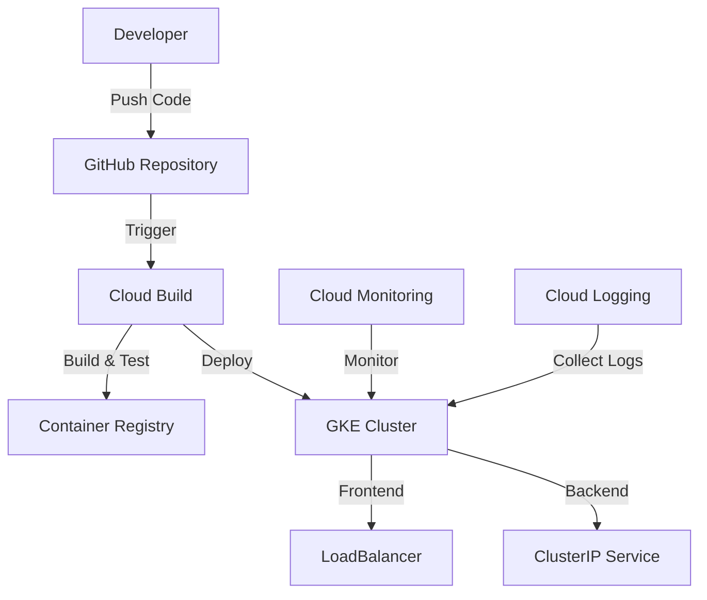
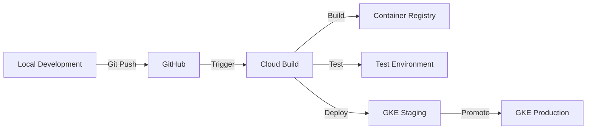
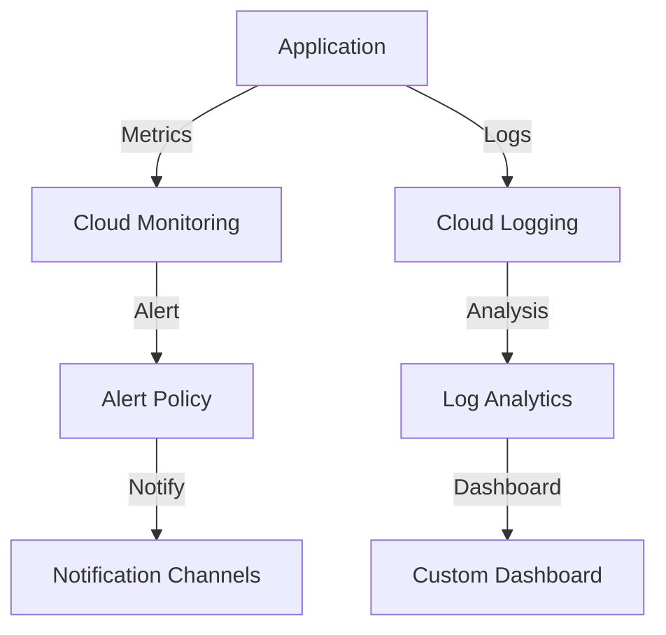

# Google Kubernetes Engine (GKE) Deployment Guide

> A comprehensive guide for deploying applications on Google Kubernetes Engine (GKE), from initial setup to production deployment and maintenance.

## 🎯 Overview

This guide provides a complete walkthrough of deploying applications to Google Kubernetes Engine (GKE). It covers everything from local development to production deployment and maintenance.

### Architecture Overview


### Key Components
1. **Source Control**: GitHub
2. **CI/CD**: Cloud Build
3. **Registry**: Google Container Registry (GCR)
4. **Orchestration**: Google Kubernetes Engine (GKE)
5. **Monitoring**: Cloud Monitoring & Logging

### Environment Setup
| Environment | Purpose | Access |
|------------|---------|---------|
| Development | Local development and testing | Local machine |
| Staging | Integration testing | Internal team |
| Production | Live application | Public users |

### Technology Stack
| Component | Technology | Version |
|-----------|------------|---------|
| Frontend | React | 18.x |
| Backend | Spring Boot | 3.x |
| Database | PostgreSQL | 15.x |
| Container | Docker | 24.x |
| Orchestration | Kubernetes | 1.27.x |

---

## 📋 Version Compatibility Matrix

### GCP Services Compatibility
| Service | Minimum Version | Recommended Version | Notes |
|---------|----------------|---------------------|-------|
| GKE | 1.25.x | 1.27.x | Regular security updates |
| Cloud Build | N/A | Latest | Auto-updated service |
| Container Registry | N/A | Latest | Auto-updated service |
| Cloud Monitoring | N/A | Latest | Auto-updated service |

### Application Stack Compatibility
| Component | Minimum Version | Maximum Version | Notes |
|-----------|----------------|-----------------|-------|
| Node.js | 16.x | 20.x | For frontend development |
| Java | 17 | 21 | For backend development |
| Maven | 3.8.x | 3.9.x | Build tool |
| npm | 8.x | 10.x | Package manager |
| Docker | 20.x | 24.x | Container runtime |

### Infrastructure Requirements
| Resource | Minimum | Recommended | Notes |
|----------|----------|-------------|--------|
| CPU | 2 vCPU | 4 vCPU | Per node |
| Memory | 4 GB | 8 GB | Per node |
| Storage | 50 GB | 100 GB | Per node |
| Network | 1 Gbps | 10 Gbps | For cluster |

---

## 📚 Quick Reference

| Resource | URL/Command |
|----------|------------|
| GCP Console | https://console.cloud.google.com |
| GKE Dashboard | https://console.cloud.google.com/kubernetes |
| Container Registry | https://console.cloud.google.com/gcr |
| Cloud Build | https://console.cloud.google.com/cloud-build |
| Monitoring | https://console.cloud.google.com/monitoring |

### Common Commands
```bash
# Get cluster credentials
gcloud container clusters get-credentials react-spring-cluster --zone us-central1-a

# View all resources in namespace
kubectl get all -n react-spring-app

# View logs
kubectl logs -f deployment/frontend -n react-spring-app

# Scale deployment
kubectl scale deployment frontend --replicas=3 -n react-spring-app
```

---

## 📋 Table of Contents

1. [Prerequisites](#prerequisites)
2. [GCP Project Setup](#gcp-project-setup)
3. [Local Development Environment](#local-development-environment)
4. [Application Architecture](#application-architecture)
5. [GKE Cluster Setup](#gke-cluster-setup)
6. [Container Registry](#container-registry)
7. [Kubernetes Resources](#kubernetes-resources)
8. [Deployment Process](#deployment-process)
9. [Monitoring and Logging](#monitoring-and-logging)
10. [Security Best Practices](#security-best-practices)
11. [Cost Management](#cost-management)
12. [Troubleshooting Guide](#troubleshooting-guide)
13. [Important Questions for GCP Team](#important-questions-for-gcp-team)
14. [GCP Cloud Console Guide](#gcp-cloud-console-guide)
15. [End-to-End Development to Deployment Process](#end-to-end-development-to-deployment-process)

## 🚀 Prerequisites

### Required Tools
- Google Cloud SDK
- kubectl
- Docker Desktop
- Git

### Required Permissions
- IAM Roles needed:
  - Kubernetes Engine Admin
  - Storage Admin
  - Container Registry Service Agent
  - Service Account User

### Account Setup
1. Create a Google Cloud account
2. Set up billing
3. Enable required APIs:
   ```bash
   gcloud services enable container.googleapis.com
   gcloud services enable containerregistry.googleapis.com
   gcloud services enable cloudbuild.googleapis.com
   ```

---

## 🛠️ GCP Project Setup

### Initial Configuration
```bash
# Install Google Cloud SDK
brew install google-cloud-sdk

# Initialize GCP configuration
gcloud init

# Set default project
gcloud config set project gcp-demo-app-2024

# Set default compute zone
gcloud config set compute/zone us-central1-a

# Authenticate with Google Cloud
gcloud auth login
```

### Project Structure
```
react-spring-gke/
├── frontend/                 # React application
├── backend/                  # Spring Boot application
├── k8s/                     # Kubernetes configurations
│   ├── namespace.yaml
│   ├── frontend-deployment.yaml
│   ├── frontend-service.yaml
│   ├── backend-deployment.yaml
│   └── backend-service.yaml
└── README.md
```

---

## 🖥️ Local Development Environment

### Frontend Setup (React)
```bash
cd frontend
npm install
npm start
```

### Backend Setup (Spring Boot)
```bash
cd backend
./mvnw spring-boot:run
```

---

## 📈 Application Architecture

### Components
1. Frontend (React):
   - Nginx server
   - Static file serving
   - API proxy configuration

2. Backend (Spring Boot):
   - REST API endpoints
   - Business logic
   - Database interactions

3. Kubernetes Resources:
   - Namespace isolation
   - Deployments
   - Services (LoadBalancer & ClusterIP)
   - ConfigMaps (if needed)
   - Secrets (if needed)

---

## 🚀 GKE Cluster Setup

### Cluster Creation
```bash
# Create GKE cluster
gcloud container clusters create react-spring-cluster \
    --num-nodes=2 \
    --machine-type=e2-medium \
    --enable-autoscaling \
    --min-nodes=2 \
    --max-nodes=5 \
    --enable-autorepair \
    --enable-autoupgrade

# Get cluster credentials
gcloud container clusters get-credentials react-spring-cluster
```

### Cluster Configuration Options
- Node pools
- Autoscaling
- Network policy
- Workload identity
- Container-native load balancing

---

## 📦 Container Registry

### Setting up Container Registry
```bash
# Configure Docker for GCR
gcloud auth configure-docker

# Build and push images
docker build -t gcr.io/gcp-demo-app-2024/react-frontend frontend/
docker push gcr.io/gcp-demo-app-2024/react-frontend

docker build -t gcr.io/gcp-demo-app-2024/spring-backend backend/
docker push gcr.io/gcp-demo-app-2024/spring-backend
```

---

## 📈 Kubernetes Resources

### Namespace
```yaml
apiVersion: v1
kind: Namespace
metadata:
  name: react-spring-app
```

### Deployments
- Frontend deployment with 2 replicas
- Backend deployment with 2 replicas
- Resource limits and requests
- Health checks
- Rolling update strategy

### Services
- Frontend: LoadBalancer type
- Backend: ClusterIP type
- Internal communication

---

## 📈 Deployment Process

### Step-by-Step Deployment
1. Create namespace:
   ```bash
   kubectl apply -f k8s/namespace.yaml
   ```

2. Deploy applications:
   ```bash
   kubectl apply -f k8s/
   ```

3. Verify deployment:
   ```bash
   kubectl get all -n react-spring-app
   ```

### Continuous Deployment
- Cloud Build integration
- Automated testing
- Rolling updates
- Rollback procedures

---

## 📊 Monitoring and Logging

### Monitoring Tools
1. Cloud Monitoring
   - CPU usage
   - Memory usage
   - Network traffic
   - Custom metrics

2. Cloud Logging
   - Application logs
   - System logs
   - Audit logs

### Setting up Monitoring
```bash
# Enable monitoring
gcloud container clusters update react-spring-cluster \
    --enable-stackdriver-kubernetes

# View logs
kubectl logs -f deployment/frontend -n react-spring-app
kubectl logs -f deployment/backend -n react-spring-app
```

---

## 🔒 Security Best Practices

1. Cluster Security
   - Private clusters
   - Network policies
   - Pod security policies

2. Container Security
   - Minimal base images
   - No root users
   - Image vulnerability scanning

3. Access Control
   - RBAC configuration
   - Service accounts
   - Workload identity

---

## 💸 Cost Management

### Cost Optimization Strategies
1. Right-sizing resources
2. Autoscaling configuration
3. Preemptible nodes
4. Committed use discounts

### Monitoring Costs
- Cloud Billing reports
- Budget alerts
- Cost allocation tags

---

## 🤔 Troubleshooting Guide

### Common Issues
1. Pod startup failures
2. Service connectivity issues
3. Resource constraints
4. Image pull errors

### Debugging Commands
```bash
# Pod logs
kubectl logs <pod-name> -n react-spring-app

# Pod description
kubectl describe pod <pod-name> -n react-spring-app

# Service endpoints
kubectl get endpoints -n react-spring-app
```

---

## 📝 Important Questions for GCP Team

### Technical Questions
1. What are the recommended node pool configurations for our workload?
2. How should we implement disaster recovery?
3. What's the best practice for handling secrets in GKE?
4. How can we implement automated scaling based on custom metrics?
5. What's the recommended approach for CI/CD integration?

### Security Questions
1. What are the security best practices for container images?
2. How should we implement network policies?
3. What's the recommended approach for managing service accounts?
4. How can we implement end-to-end encryption?

### Operations Questions
1. What monitoring and alerting setup do you recommend?
2. How should we handle cluster upgrades?
3. What's the best practice for log management?
4. How can we optimize costs while maintaining performance?

### Compliance Questions
1. How can we ensure our GKE setup meets compliance requirements?
2. What audit logging should we enable?
3. How should we handle data residency requirements?

---

## 🖥️ GCP Cloud Console Guide

The Google Cloud Console (https://console.cloud.google.com) is your central hub for managing GCP resources. Here's a comprehensive guide to navigating and using the console for GKE deployments.

### 1. GKE Dashboard Navigation

#### Accessing GKE
1. Go to https://console.cloud.google.com
2. Select your project from the top dropdown
3. Navigate to "Kubernetes Engine" in the left sidebar
4. Click "Clusters" to view your GKE clusters

#### Key Sections in GKE Dashboard
1. **Clusters**
   - List of all clusters
   - Cluster status and health
   - Node pool information
   - Upgrade availability
   - Location and version details

2. **Workloads**
   - Deployments status
   - Pod health and metrics
   - Container logs
   - Resource utilization
   - Rolling update status

3. **Services & Ingress**
   - Load balancer status
   - External IP addresses
   - Service endpoints
   - Ingress configurations

4. **Applications**
   - Deployed applications
   - Application metrics
   - Resource consumption
   - Health status

5. **Configuration**
   - ConfigMaps
   - Secrets
   - Storage classes
   - Persistent volumes

### 2. Monitoring & Logging

#### Cloud Monitoring Dashboard
1. **Cluster Metrics**
   - CPU utilization
   - Memory usage
   - Network throughput
   - Disk I/O
   - Node status

2. **Custom Dashboards**
   ```bash
   # Create custom dashboard via gcloud
   gcloud monitoring dashboards create \
     --config-from-file=dashboard-config.json
   ```

3. **Alerts**
   - Resource utilization alerts
   - Error rate thresholds
   - Uptime checks
   - Budget alerts

#### Cloud Logging
1. **Log Explorer**
   - Container logs
   - System logs
   - Audit logs
   - Custom logs

2. **Log Queries**
   ```
   resource.type="k8s_container"
   resource.labels.cluster_name="react-spring-cluster"
   resource.labels.namespace_name="react-spring-app"
   ```

3. **Log-based Metrics**
   - Error rates
   - Request latency
   - Custom metrics

### 3. Security & IAM

#### Security Center
1. **Security Health Analytics**
   - Vulnerability reports
   - Security posture
   - Compliance status

2. **Web Security Scanner**
   - Application vulnerabilities
   - Configuration issues
   - Security misconfigurations

#### IAM & Admin
1. **Service Accounts**
   ```bash
   # View service accounts in console
   Navigation Menu > IAM & Admin > Service Accounts
   ```

2. **IAM Roles**
   - Kubernetes Engine Admin
   - Kubernetes Engine Developer
   - Kubernetes Engine Viewer

3. **Audit Logs**
   - Access logs
   - Data access
   - System events

### 4. Cost Management

#### Billing Dashboard
1. **Cost Breakdown**
   - Per-cluster costs
   - Resource utilization costs
   - Network costs

2. **Budget & Alerts**
   ```bash
   # Set up budget alert
   Navigation Menu > Billing > Budgets & Alerts > Create Budget
   ```

3. **Cost Optimization**
   - Recommendations
   - Unused resources
   - Right-sizing suggestions

### 5. Cloud Build Integration

#### Build Triggers
1. **Automated Builds**
   ```yaml
   # cloudbuild.yaml
   steps:
   - name: 'gcr.io/cloud-builders/docker'
     args: ['build', '-t', 'gcr.io/$PROJECT_ID/react-frontend', './frontend']
   - name: 'gcr.io/cloud-builders/docker'
     args: ['push', 'gcr.io/$PROJECT_ID/react-frontend']
   ```

2. **Build History**
   - Build logs
   - Success/failure status
   - Deployment status

### 6. Container Registry

#### Image Management
1. **Repository Browser**
   - Image versions
   - Size information
   - Pull commands

2. **Vulnerability Scanning**
   ```bash
   # View vulnerabilities in console
   Navigation Menu > Container Registry > Images > [Select Image] > Vulnerability Scan
   ```

### 7. Network Services

#### VPC Network
1. **Firewall Rules**
   - Ingress rules
   - Egress rules
   - Network policies

2. **Load Balancers**
   - Frontend configurations
   - Backend services
   - Health checks

### 8. Cloud Console Features for Development

#### Cloud Shell
1. **Integrated Terminal**
   ```bash
   # Access cluster directly from console
   gcloud container clusters get-credentials react-spring-cluster --zone us-central1-a
   kubectl get pods -n react-spring-app
   ```

2. **Code Editor**
   - Edit YAML files
   - View logs
   - Run commands

#### Cloud Code
1. **IDE Integration**
   - Kubernetes development
   - Deployment configs
   - Debug capabilities

### 9. Useful Console URLs

1. **GKE Clusters**
   ```
   https://console.cloud.google.com/kubernetes/list
   ```

2. **Workloads**
   ```
   https://console.cloud.google.com/kubernetes/workload
   ```

3. **Services**
   ```
   https://console.cloud.google.com/kubernetes/discovery
   ```

4. **Storage**
   ```
   https://console.cloud.google.com/kubernetes/storage
   ```

### 10. Console-Specific Operations

1. **Cluster Operations**
   - Create/delete clusters
   - Modify node pools
   - Update cluster version
   - Configure auto-scaling

2. **Deployment Operations**
   - Scale deployments
   - View pod logs
   - Debug containers
   - Rolling updates

3. **Monitoring Operations**
   - Create dashboards
   - Set up alerts
   - View metrics
   - Analyze logs

4. **Security Operations**
   - Manage service accounts
   - Configure RBAC
   - Set up network policies
   - Manage secrets

### 11. Best Practices for Console Usage

1. **Dashboard Organization**
   - Pin frequently used pages
   - Create custom dashboards
   - Set up relevant alerts

2. **Access Management**
   - Use principle of least privilege
   - Regular access review
   - Enable audit logging

3. **Cost Control**
   - Set up budgets
   - Monitor resource usage
   - Review recommendations

4. **Monitoring Setup**
   - Configure uptime checks
   - Set up log-based metrics
   - Create custom dashboards

---

## 📊 Current Deployment Status

### Frontend Service
- **Type**: LoadBalancer
- **External IP**: 34.58.146.62
- **Port**: 80
- **Access URL**: http://34.58.146.62

### Backend Service
- **Type**: ClusterIP
- **Internal IP**: 34.118.236.19
- **Port**: 8080
- **Access**: Internal cluster access only

### Container Images
- Frontend: `gcr.io/gcp-demo-app-2024/react-frontend:latest`
- Backend: `gcr.io/gcp-demo-app-2024/spring-backend:latest`

---

## 📚 Additional Resources

1. [GKE Documentation](https://cloud.google.com/kubernetes-engine/docs)
2. [Kubernetes Best Practices](https://cloud.google.com/kubernetes-engine/docs/best-practices)
3. [Cloud Build Documentation](https://cloud.google.com/build/docs)
4. [Container Security](https://cloud.google.com/kubernetes-engine/docs/concepts/security-overview)

---

## 🤝 Support and Community

- [GCP Support](https://cloud.google.com/support)
- [GKE GitHub Repository](https://github.com/kubernetes/kubernetes)
- [Stack Overflow](https://stackoverflow.com/questions/tagged/google-kubernetes-engine)
- [GCP Community Discord](https://discord.gg/google-cloud-platform)

---

## 🔄 End-to-End Development to Deployment Process

### 1. Development Phase

#### Local Development Environment
1. **Frontend (React)**
   ```typescript
   // Sample React Component Structure
   src/
   ├── components/          # Reusable UI components
   ├── pages/              # Route-based components
   ├── services/           # API integration
   ├── hooks/              # Custom React hooks
   ├── utils/              # Helper functions
   └── types/              # TypeScript definitions
   ```

2. **Backend (Spring Boot)**
   ```java
   // Sample Spring Boot Structure
   src/main/java/
   ├── config/             # Configuration classes
   ├── controllers/        # REST endpoints
   ├── services/           # Business logic
   ├── repositories/       # Data access
   ├── models/            # Domain entities
   └── utils/             # Helper classes
   ```

#### Development Best Practices
1. **Code Organization**
   ```typescript
   // Frontend API Service Example
   export class ApiService {
     private baseUrl: string;
   
     constructor() {
       this.baseUrl = process.env.REACT_APP_API_URL || '/api';
     }
   
     async getData(): Promise<Response> {
       return fetch(`${this.baseUrl}/data`, {
         headers: {
           'Content-Type': 'application/json'
         }
       });
     }
   }
   ```

2. **Environment Configuration**
   ```properties
   # Backend application.properties
   spring.profiles.active=${SPRING_PROFILES_ACTIVE:dev}
   server.port=${SERVER_PORT:8080}
   
   # Development
   spring.datasource.url=jdbc:postgresql://localhost:5432/devdb
   
   # Production
   spring.datasource.url=${DATABASE_URL}
   ```

### 2. Containerization Process

#### Docker Image Optimization
1. **Frontend Dockerfile Explained**
   ```dockerfile
   # Build stage
   FROM node:18-alpine as build
   WORKDIR /app
   
   # Install dependencies first (better caching)
   COPY package*.json ./
   RUN npm ci --only=production
   
   # Copy source and build
   COPY . .
   RUN npm run build
   
   # Production stage
   FROM nginx:alpine
   # Copy built assets
   COPY --from=build /app/build /usr/share/nginx/html
   # Copy nginx configuration
   COPY nginx.conf /etc/nginx/conf.d/default.conf
   
   # Health check
   HEALTHCHECK --interval=30s --timeout=3s \
     CMD curl -f http://localhost/ || exit 1
   
   EXPOSE 80
   CMD ["nginx", "-g", "daemon off;"]
   ```

2. **Backend Dockerfile Explained**
   ```dockerfile
   # Build stage
   FROM maven:3.8-openjdk-17 as build
   WORKDIR /app
   
   # Copy pom.xml first for better caching
   COPY pom.xml .
   RUN mvn dependency:go-offline
   
   # Copy source and build
   COPY src ./src
   RUN mvn package -DskipTests
   
   # Production stage
   FROM openjdk:17-jdk-slim
   WORKDIR /app
   
   # Copy built jar
   COPY --from=build /app/target/*.jar app.jar
   
   # Add health check
   HEALTHCHECK --interval=30s --timeout=3s \
     CMD curl -f http://localhost:8080/actuator/health || exit 1
   
   EXPOSE 8080
   ENTRYPOINT ["java", "-jar", "app.jar"]
   ```

### 3. CI/CD Pipeline

#### Cloud Build Configuration
```yaml
# cloudbuild.yaml
steps:
  # Build and test frontend
  - name: 'node:18'
    entrypoint: npm
    args: ['install']
    dir: 'frontend'
  
  - name: 'node:18'
    entrypoint: npm
    args: ['test']
    dir: 'frontend'
  
  # Build frontend image
  - name: 'gcr.io/cloud-builders/docker'
    args: [
      'build',
      '-t', 'gcr.io/$PROJECT_ID/react-frontend:$COMMIT_SHA',
      './frontend'
    ]
  
  # Build and test backend
  - name: 'maven:3.8-openjdk-17'
    entrypoint: mvn
    args: ['test']
    dir: 'backend'
  
  # Build backend image
  - name: 'gcr.io/cloud-builders/docker'
    args: [
      'build',
      '-t', 'gcr.io/$PROJECT_ID/spring-backend:$COMMIT_SHA',
      './backend'
    ]
  
  # Push images
  - name: 'gcr.io/cloud-builders/docker'
    args: ['push', 'gcr.io/$PROJECT_ID/react-frontend:$COMMIT_SHA']
  
  - name: 'gcr.io/cloud-builders/docker'
    args: ['push', 'gcr.io/$PROJECT_ID/spring-backend:$COMMIT_SHA']
  
  # Update kubernetes deployments
  - name: 'gcr.io/cloud-builders/kubectl'
    args: [
      'set', 'image',
      'deployment/frontend',
      'frontend=gcr.io/$PROJECT_ID/react-frontend:$COMMIT_SHA',
      '-n', 'react-spring-app'
    ]
  
  - name: 'gcr.io/cloud-builders/kubectl'
    args: [
      'set', 'image',
      'deployment/backend',
      'backend=gcr.io/$PROJECT_ID/spring-backend:$COMMIT_SHA',
      '-n', 'react-spring-app'
    ]

# Configure kubectl
options:
  env:
    - 'CLOUDSDK_COMPUTE_ZONE=us-central1-a'
    - 'CLOUDSDK_CONTAINER_CLUSTER=react-spring-cluster'
```

### 4. GKE Configuration

#### Network Configuration
```yaml
# network-policy.yaml
apiVersion: networking.k8s.io/v1
kind: NetworkPolicy
metadata:
  name: frontend-policy
  namespace: react-spring-app
spec:
  podSelector:
    matchLabels:
      app: frontend
  policyTypes:
  - Ingress
  - Egress
  ingress:
  - from:
    - namespaceSelector:
        matchLabels:
          name: ingress-nginx
  egress:
  - to:
    - podSelector:
        matchLabels:
          app: backend
    ports:
    - protocol: TCP
      port: 8080
```

#### Resource Management
```yaml
# resource-quotas.yaml
apiVersion: v1
kind: ResourceQuota
metadata:
  name: compute-resources
  namespace: react-spring-app
spec:
  hard:
    requests.cpu: "4"
    requests.memory: 8Gi
    limits.cpu: "8"
    limits.memory: 16Gi
```

### 5. Monitoring Setup

#### Custom Metrics
```yaml
# custom-metrics.yaml
apiVersion: monitoring.googleapis.com/v1
kind: MetricDescriptor
metadata:
  name: custom.googleapis.com/http/response_time
spec:
  description: "HTTP response time"
  metricKind: GAUGE
  valueType: DOUBLE
  unit: "ms"
  labels:
    - key: endpoint
      description: "API endpoint"
    - key: method
      description: "HTTP method"
```

#### Alert Policies
```yaml
# alert-policy.yaml
combiner: OR
conditions:
- conditionThreshold:
    aggregations:
    - alignmentPeriod: 300s
      crossSeriesReducer: REDUCE_MEAN
      perSeriesAligner: ALIGN_MEAN
    comparison: COMPARISON_GT
    duration: 300s
    filter: |
      metric.type="custom.googleapis.com/http/response_time"
      resource.type="k8s_container"
    thresholdValue: 1000
displayName: "High Response Time Alert"
```

### 6. Production Deployment Checklist

#### Pre-deployment Verification
1. **Security Checks**
   ```bash
   # Scan container images
   gcloud container images scan gcr.io/$PROJECT_ID/react-frontend:latest
   
   # Check pod security
   kubectl auth can-i create pods --namespace react-spring-app
   ```

2. **Resource Verification**
   ```bash
   # Check resource quotas
   kubectl describe quota -n react-spring-app
   
   # Verify node capacity
   kubectl describe nodes
   ```

#### Deployment Process
1. **Database Migration**
   ```bash
   # Apply database migrations
   kubectl create job --from=cronjob/db-migrate db-migrate-manual
   
   # Verify migration status
   kubectl logs job/db-migrate-manual
   ```

2. **Rolling Update**
   ```bash
   # Update with zero downtime
   kubectl set image deployment/frontend \
     frontend=gcr.io/$PROJECT_ID/react-frontend:new -n react-spring-app \
     --record
   
   # Monitor rollout
   kubectl rollout status deployment/frontend -n react-spring-app
   ```

### 7. Post-deployment Tasks

#### Verification Steps
1. **Health Checks**
   ```bash
   # Check endpoints
   curl -f https://$FRONTEND_IP/health
   curl -f http://$BACKEND_SERVICE:8080/actuator/health
   ```

2. **Performance Testing**
   ```bash
   # Load test with hey
   hey -n 1000 -c 100 https://$FRONTEND_IP/api/test
   ```

#### Monitoring Setup
1. **Dashboard Creation**
   ```bash
   # Create monitoring dashboard
   gcloud monitoring dashboards create \
     --config-from-file=dashboard.json
   ```

2. **Log Analysis**
   ```bash
   # Set up log-based metrics
   gcloud logging metrics create http_500_errors \
     --description="Count of HTTP 500 errors" \
     --log-filter="resource.type=k8s_container severity=ERROR"
   ```

---

> **Note**: Keep this document updated with your specific deployment configurations and any lessons learned during the deployment process.

---

## 🔄 Deployment Workflow

### 1. Development Flow


### 2. Release Process
1. **Development**
   - Feature branch creation
   - Local testing
   - Code review
   - Merge to main

2. **Staging**
   - Automated deployment
   - Integration testing
   - Performance testing
   - Security scanning

3. **Production**
   - Manual approval
   - Rolling update
   - Health monitoring
   - Rollback plan

### 3. Monitoring Strategy


## 🔐 Security Implementation

### 1. Authentication & Authorization
```yaml
# Example RBAC Configuration
apiVersion: rbac.authorization.k8s.io/v1
kind: RoleBinding
metadata:
  name: developer-binding
  namespace: react-spring-app
subjects:
- kind: User
  name: developer@company.com
  apiGroup: rbac.authorization.k8s.io
roleRef:
  kind: Role
  name: developer
  apiGroup: rbac.authorization.k8s.io
```

### 2. Network Security
```yaml
# Example Network Policy
apiVersion: networking.k8s.io/v1
kind: NetworkPolicy
metadata:
  name: restrict-traffic
  namespace: react-spring-app
spec:
  podSelector:
    matchLabels:
      app: backend
  policyTypes:
  - Ingress
  ingress:
  - from:
    - podSelector:
        matchLabels:
          app: frontend
    ports:
    - protocol: TCP
      port: 8080
```

### 3. Secret Management
```yaml
# Example Secret Configuration
apiVersion: v1
kind: Secret
metadata:
  name: app-secrets
  namespace: react-spring-app
type: Opaque
stringData:
  API_KEY: ${API_KEY}
  DATABASE_URL: ${DATABASE_URL}
```

## 📈 Performance Optimization

### 1. Resource Optimization
```yaml
# Example Resource Limits
resources:
  requests:
    cpu: 100m
    memory: 256Mi
  limits:
    cpu: 200m
    memory: 512Mi
```

### 2. Autoscaling Configuration
```yaml
# Example HPA Configuration
apiVersion: autoscaling/v2
kind: HorizontalPodAutoscaler
metadata:
  name: frontend-hpa
  namespace: react-spring-app
spec:
  scaleTargetRef:
    apiVersion: apps/v1
    kind: Deployment
    name: frontend
  minReplicas: 2
  maxReplicas: 10
  metrics:
  - type: Resource
    resource:
      name: cpu
      target:
        type: Utilization
        averageUtilization: 80
```

### 3. Cache Strategy
```yaml
# Example Redis Configuration
apiVersion: v1
kind: ConfigMap
metadata:
  name: redis-config
  namespace: react-spring-app
data:
  redis.conf: |
    maxmemory 256mb
    maxmemory-policy allkeys-lru
